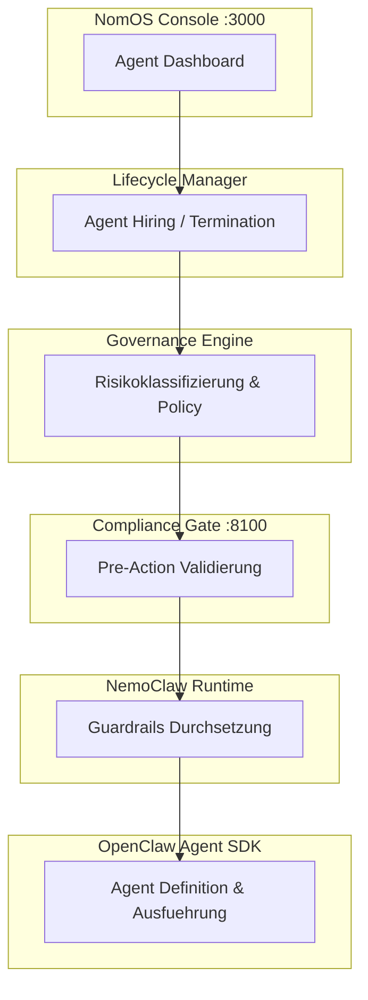
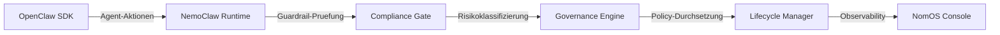

# NomOS

> Das agentenbasierte Framework, das EU AI Act Compliance durchsetzt — nicht durch Empfehlung, sondern durch Design.



## Was ist NomOS?

NomOS ist eine Compliance-first Runtime fuer AI Agents, die jede Anforderung des EU AI Act auf eine durchsetzbare Software-Kontrolle abbildet. Es fängt Agent-Aktionen vor der Ausfuehrung ab, klassifiziert Risiken in Echtzeit und fuehrt den Audit-Trail, den Regulierer erwarten. Gebaut fuer Organisationen, die autonome AI Agents betreiben und Compliance nachweisen muessen — nicht nur behaupten.

## Schnellstart

```bash
git clone https://github.com/ai-engineering-at/nomos.git
cd nomos
docker compose up -d
```

Oeffne `http://localhost:3000` — stelle deinen ersten Agent ein.

## Architektur



| Schicht | Verantwortung |
|---------|---------------|
| **OpenClaw** | Agent-Definition, Tool-Binding, Ausfuehrung |
| **NemoClaw** | Guardrails, Input/Output-Filterung |
| **Compliance Gate** | Pre-Action Validierung gegen EU AI Act |
| **Governance Engine** | Risikoklassifizierung, Policy-Verwaltung |
| **Lifecycle Manager** | Agent Hiring, Monitoring, Termination |
| **NomOS Console** | Dashboard, Audit-Logs, Reporting |

## Komponenten

| Komponente | Beschreibung | Port |
|------------|-------------|------|
| `nomos-console` | Web Dashboard fuer Agent-Verwaltung und Audit | 3000 |
| `nomos-api` | REST API fuer Governance und Lifecycle | 8000 |
| `nomos-gate` | Compliance Gate — validiert Aktionen vor Ausfuehrung | 8100 |
| `nomos-cli` | CLI fuer lokale Entwicklung und Agent-Verwaltung | — |

## Compliance-Abdeckung

| EU AI Act Artikel | NomOS Komponente | Durchsetzungsart |
|-------------------|-----------------|-----------------|
| Art. 6 — Risikoklassifizierung | Governance Engine | Automatische Klassifizierung bei Agent-Registrierung |
| Art. 9 — Risikomanagementsystem | Lifecycle Manager | Kontinuierliches Monitoring mit Kill Switch |
| Art. 11 — Technische Dokumentation | NomOS Console | Automatisch generierter Audit-Trail |
| Art. 13 — Transparenz | Compliance Gate | Aktions-Logging mit menschenlesbaren Erklaerungen |
| Art. 14 — Menschliche Aufsicht | NomOS Console | Genehmigungsworkflows, Eskalationspfade |
| Art. 15 — Genauigkeit & Robustheit | NemoClaw Runtime | Input/Output-Validierung, Guardrails |
| Art. 26 — Pflichten des Betreibers | Governance Engine | Policy-Vorlagen, Compliance-Checklisten |

## Preise

| Plan | Preis | Agents | Funktionen |
|------|-------|--------|------------|
| Free | EUR 0 | Bis zu 3 | Kern-Compliance, Community-Support |
| Starter | EUR 49/Monat | Bis zu 10 | Prioritaets-Support, erweitertes Audit |
| Business | EUR 149/Monat | Bis zu 50 | SSO, benutzerdefinierte Policies, SLA |
| Enterprise | EUR 29/Agent/Monat | Unbegrenzt | Dedizierter Support, On-Prem, individuelle Integrationen |

## Lizenz

Fair Source License v1.0 — kostenlos fuer bis zu 3 AI Agents.
Kommerzielle Lizenz erforderlich ab 4+. Siehe [LICENSE](LICENSE) fuer Details.

## Dokumentation

Die vollstaendige Dokumentation ist unter [`docs/en/`](docs/en/) verfuegbar.

## Mitwirken

Wir freuen uns ueber Beitraege. Siehe [CONTRIBUTING.md](CONTRIBUTING.md) fuer Richtlinien.

## Entwickelt von

[AI Engineering](https://ai-engineering.at) — Wien, Oesterreich.
