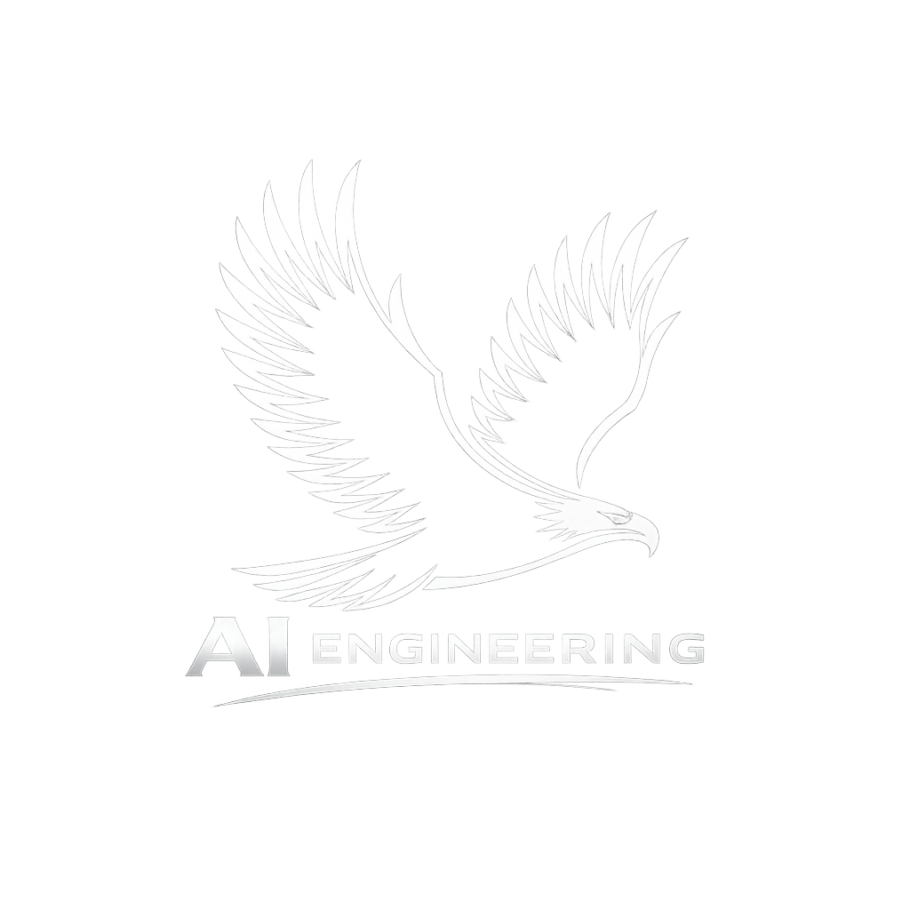

<p align="center">
  
</p>

<h1 align="center">NomOS</h1>

<p align="center">
  <strong>EU AI Act Compliance Control Plane for AI Agents</strong>
</p>

<p align="center">
  
  
  
  
  
</p>

<p align="center">
  
  
  
  
  
  
</p>

---

> *"Jeder entwickelt fuer sich, wir fuer alle."*
>
> NomOS enforces EU AI Act compliance not by recommendation, but by design. Every requirement maps to an enforceable software control. Agents that don't comply don't deploy.

---

## Quick Start

```bash
git clone https://github.com/AI-Engineering-at/nomos.git
cd nomos
cp .env.example .env
# Set the required secrets + an LLM provider key, then:
docker compose up -d
```

Open **http://localhost:3040**. On first run, create the admin account
via the bootstrap form (or `POST /api/users/bootstrap`). See the
[Quickstart](docs/quickstart.md) for required env vars and the full
flow.

---

## What is NomOS?

NomOS is a **Compliance Control Plane** that wraps [OpenClaw](https://openclaw.ai) headless (NemoClaw integration is currently a manifest field only — see [PLAN.md](docs/hardening-2026-05-20/PLAN.md)). The customer opens a browser, sees NomOS, and nothing else.

```
                        +------------------+
                        |    Browser       |
                        |  localhost:3040  |
                        +--------+---------+
                                 |
                    +------------+------------+
                    |     NomOS Console       |
                    |    (Next.js 15)         |
                    +------------+------------+
                                 |
              +------------------+------------------+
              |                                     |
   +----------+----------+            +-------------+-------------+
   |    NomOS API        |            |   OpenClaw Gateway        |
   |   (FastAPI)         |            |   (headless, Plugin)      |
   |   19 Routers        |            |   11 Runtime Hooks        |
   |   47+ Endpoints     |            |   Compliance Gate         |
   +----------+----------+            +-------------+-------------+
              |                                     |
   +----------+----------+            +-------------+-------------+
   |   PostgreSQL 16     |            |   LLM Provider            |
   |   + pgvector        |            |   (any: NVIDIA, OpenAI,   |
   +---------------------+            |    Anthropic, local)      |
   |   Valkey (Cache)    |            +---------------------------+
   +---------------------+
   |   HashiCorp Vault   |
   +---------------------+
```

## Key Features

### Compliance Engine
- **Compliance Gate** — Generates 5 required EU AI Act documents (DPIA, Art. 30, Art. 50, Art. 14, Art. 12). Agents are blocked from deployment until all documents are signed.
- **Audit Trail v2** — Tamper-evident audit chain with **HMAC-SHA256 + Ed25519 per-entry signatures + RFC 6962 Merkle transparency log**. Signed Tree Head (STH) + inclusion-proof endpoints let any regulator verify a single event with only the public key — no DB or shared secret needed. Hourly external anchoring + daily integrity checkpoint. Retention floor 180 days per EU AI Act Art. 12. See [CHANGELOG](CHANGELOG.md) 0.2.0.
- **PII Filter** — Real-time detection and redaction of personal data in agent communications (DSGVO Art. 6).
- **Budget Control** — Per-agent cost limits with automatic pause on threshold breach (Art. 14 risk management).

### Operations
- **Fleet Management** — Hire, pause, resume, terminate agents through the Console.
- **Real-time Chat** — Talk to your agents through NomOS. Every message passes through compliance hooks.
- **Incident Management** — Automatic incident creation on agent errors with Art. 14 EU AI Act classification.
- **Task Dispatch** — Assign tasks to agents with deadline tracking and approval workflows.

### Security
- **HashiCorp Vault** integration for all secrets (JWT, API keys,
  gateway token, DB password) — Vault-first settings source, runs as its
  own compose service.
- **Caddy TLS** — automatic HTTPS reverse proxy on 80/443
  (`NOMOS_DOMAIN`).
- **RBAC + agent ownership** — `/api/monitoring/*` and `GET
  /api/settings` are admin-only; agent state-change and chat endpoints
  enforce agent ownership (`check_agent_access`); heartbeat requires the
  agent-actor principal.
- **Hardened HTTP** — `SecurityHeadersMiddleware` (nosniff, X-Frame
  DENY, HSTS on HTTPS), `SameSite=Strict` session cookies, redacted
  structured logging. Audit hash chain combines HMAC
  (`NOMOS_HASHCHAIN_HMAC_KEY`, fail-closed) and Ed25519 signatures
  (`NOMOS_AUDIT_SIGNING_KEY`, fail-closed).
- **Rate Limiting** — Valkey-backed distributed rate limiter.
- **ARQ worker** — 7 cron jobs (retention, stale-agent detection,
  incident deadlines, approval expiry, alert processing, **audit
  anchor head** hourly, **audit integrity checkpoint** daily).
- **Monitoring & Alerting** — admin-only metrics/alerts/alert-rules
  under `/api/monitoring`.
- **11 OpenClaw Hooks** — Every agent action passes through compliance,
  audit, PII, and budget checks before execution.

## Architecture

```
nomos/
 |- nomos-api/        Python 3.12 FastAPI — 19 router modules (incl. monitoring, system)
 |- nomos-cli/        Python CLI — local + API-backed commands, structured logging
 |- nomos-console/    Next.js 15 / React 19 — 20 pages (admin + user)
 |- nomos-plugin/     TypeScript — OpenClaw gateway plugin, 11 hooks
 |- schemas/          YAML schema templates for agent manifests
 +- templates/        Agent role templates
```

### Data Flow

```
User --> Console --> Next.js rewrite --> FastAPI --> PostgreSQL
User --> Console --> API Proxy --> OpenClaw Gateway (+NomOS Plugin) --> LLM
                                       |
                                  11 Hooks fire:
                                  - Compliance Gate
                                  - PII Filter
                                  - Budget Check
                                  - Audit Entry
                                  - Heartbeat
```

## Tech Stack

| Layer | Technology | Purpose |
|-------|-----------|---------|
| Backend | Python 3.12, FastAPI, Pydantic v2 | API, compliance logic, audit |
| Frontend | TypeScript strict, Next.js 15, React 19 | Console UI (dark mode default) |
| Database | PostgreSQL 16 + pgvector | Persistent storage + embeddings |
| Cache | Valkey (BSD-3 Redis replacement) | Rate limiting, sessions, events |
| Secrets | HashiCorp Vault | JWT, API keys, gateway tokens |
| Gateway | OpenClaw 2026.5.18 (pinned in `nomos-plugin/Dockerfile.gateway`) | LLM-provider-agnostic agent runtime |
| Sandbox | NemoClaw (optional) | Container isolation for agents |
| Voice | Piper TTS + Whisper.cpp (optional) | Speech I/O (MIT licensed) |
| CI/CD | GitHub Actions | 5-stage pipeline (lint, test, quality, build, summary) |

## CLI

```bash
nomos hire    --name "Mani" --role external-secretary   # Create agent (local)
nomos gate    --agent-dir ./data/agents/mani            # Generate compliance docs
nomos verify  --agent-dir ./data/agents/mani            # Verify full compliance
nomos fleet   --agents-dir ./data/agents                # List local agents
nomos audit   --agent-dir ./data/agents/mani --verify   # Verify audit chain
# API-backed: nomos pause|resume|retire|forget|assign|costs|incidents|workspace
```

CLI diagnostics: set `NOMOS_LOG_LEVEL` (DEBUG/INFO/WARNING/ERROR) for
structured JSON logs on stderr; normal output stays on stdout.

## API

Base URL: `http://localhost:8060`

| Domain | Endpoints | Description |
|--------|-----------|-------------|
| Auth | `/api/auth/*` | JWT login, 2FA, recovery keys |
| Agents | `/api/agents/*` | CRUD, hire, pause, resume, terminate |
| Fleet | `/api/fleet/*` | Fleet overview, status aggregation |
| Compliance | `/api/compliance/*` | Gate checks, document generation |
| Audit | `/api/audit/*`, `/api/agents/{id}/audit/sth`, `/api/agents/{id}/audit/proof/{n}` | Hash chain entries, verification, **Signed Tree Head**, **inclusion proofs** (RFC 6962) |
| Users | `/api/users/*` | RBAC user management |
| Tasks | `/api/tasks/*` | Task dispatch and tracking |
| Approvals | `/api/approvals/*` | Human-in-the-loop approval workflow |
| Costs | `/api/costs/*` | Per-agent cost tracking |
| Budget | `/api/budget/*` | Budget limits and alerts |
| PII | `/api/pii/*` | Personal data detection and filtering |
| Incidents | `/api/incidents/*` | Incident management (Art. 14) |
| DSGVO | `/api/dsgvo/*` | Right to erasure (Art. 17) |
| Settings | `/api/settings` | System configuration (GET admin-only) |
| Monitoring | `/api/monitoring/*` | Metrics, alerts, alert-rules (**admin-only**) |
| System | `/api/system/*` | Setup-wizard status + bootstrap-only unseal key |
| Health | `/api/health` | Service health + Vault/PG/Valkey/gateway status |

See [API Reference](docs/api-reference.md) for the authoritative
endpoint and authorization table.

## Pricing

| Plan | Agents | Price |
|------|--------|-------|
| **Free** | Up to 3 | All features included |
| **Commercial** | 4+ | [Contact us](https://ai-engineering.at) |

Fair Core License (FCL) — full functionality at every tier. No feature gating.

## Documentation

| Document | Description |
|----------|-------------|
| [Quickstart](docs/quickstart.md) | Get running in 5 minutes |
| [API Reference](docs/api-reference.md) | Complete REST API (49+ endpoints, incl. STH + inclusion-proof) |
| [CLI Reference](docs/cli-reference.md) | All commands with examples |
| [Architecture](docs/architecture.md) | System design, data flow, security |
| [Operations Runbook](docs/operations-runbook.md) | Bring-up, healthchecks, secrets, backup, audit-key rotation, regulator export, troubleshooting |
| [Compliance Guide](docs/compliance-guide.md) | EU AI Act + DSGVO coverage, Audit-Trail v2 Phase-B1 |
| [Hardening Plan 2026-05-20](docs/hardening-2026-05-20/PLAN.md) | Audit-Trail v2 roadmap (A1-A6 + B1 shipped) |
| [CHANGELOG](CHANGELOG.md) | Release history per component |

**Deutsch:**

| Dokument | Beschreibung |
|----------|-------------|
| [Schnellstart](docs/de/schnellstart.md) | In 5 Minuten starten |
| [API-Referenz](docs/de/api-referenz.md) | Vollstaendige REST API |
| [CLI-Referenz](docs/de/cli-referenz.md) | Alle 5 Befehle |
| [Architektur](docs/de/architektur.md) | System-Design und Sicherheit |
| [Compliance-Leitfaden](docs/de/compliance-leitfaden.md) | EU AI Act + DSGVO |

## Deployment Tiers

| Tier | Target | How |
|------|--------|-----|
| **Enterprise VPS** | Managed hosting | We deploy and maintain |
| **Docker Self-Hosted** | Your server | `docker compose up -d` |
| **Open Source** | Community | Fork and customize |

## License

**Fair Source License v1.0** — Free for up to 3 AI Agents. Commercial license required for 4+.

See [LICENSE](LICENSE) for details.

---

<p align="center">
  Built with discipline by <a href="https://ai-engineering.at"><strong>AI Engineering</strong></a> — Vienna, Austria.
</p>
