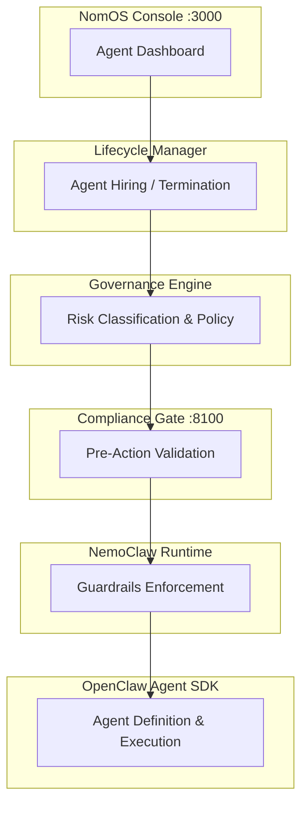
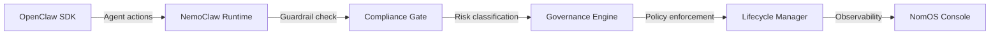

# NomOS

> The agentic framework that enforces EU AI Act compliance — not by recommendation, but by design.



## What is NomOS?

NomOS is a compliance-first runtime for AI agents that maps every requirement of the EU AI Act to an enforceable software control. It intercepts agent actions before execution, classifies risk in real time, and maintains the audit trail regulators expect. Built for organizations that deploy autonomous AI agents and need to prove compliance — not just claim it.

## Quick Start

```bash
git clone https://github.com/ai-engineering-at/nomos.git
cd nomos
docker compose up -d
```

Open `http://localhost:3000` — hire your first agent.

## Architecture



| Layer | Responsibility |
|-------|---------------|
| **OpenClaw** | Agent definition, tool binding, execution |
| **NemoClaw** | Guardrails, input/output filtering |
| **Compliance Gate** | Pre-action validation against EU AI Act |
| **Governance Engine** | Risk classification, policy management |
| **Lifecycle Manager** | Agent hiring, monitoring, termination |
| **NomOS Console** | Dashboard, audit logs, reporting |

## Components

| Component | Description | Port |
|-----------|-------------|------|
| `nomos-console` | Web dashboard for agent management and audit | 3000 |
| `nomos-api` | REST API for governance and lifecycle | 8000 |
| `nomos-gate` | Compliance gate — validates actions pre-execution | 8100 |
| `nomos-cli` | CLI for local development and agent management | — |

## Compliance Coverage

| EU AI Act Article | NomOS Component | Enforcement Type |
|-------------------|-----------------|-----------------|
| Art. 6 — Risk Classification | Governance Engine | Automatic classification on agent registration |
| Art. 9 — Risk Management System | Lifecycle Manager | Continuous monitoring with kill switch |
| Art. 11 — Technical Documentation | NomOS Console | Auto-generated audit trail |
| Art. 13 — Transparency | Compliance Gate | Action logging with human-readable explanations |
| Art. 14 — Human Oversight | NomOS Console | Approval workflows, escalation paths |
| Art. 15 — Accuracy & Robustness | NemoClaw Runtime | Input/output validation, guardrails |
| Art. 26 — Deployer Obligations | Governance Engine | Policy templates, compliance checklists |

## Pricing

| Plan | Price | Agents | Features |
|------|-------|--------|----------|
| Free | EUR 0 | Up to 3 | Core compliance, community support |
| Starter | EUR 49/mo | Up to 10 | Priority support, advanced audit |
| Business | EUR 149/mo | Up to 50 | SSO, custom policies, SLA |
| Enterprise | EUR 29/agent/mo | Unlimited | Dedicated support, on-prem, custom integrations |

## License

Fair Source License v1.0 — free for up to 3 AI Agents.
Commercial license required for 4+. See [LICENSE](LICENSE) for details.

## Documentation

Full documentation is available in [`docs/en/`](docs/en/).

## Contributing

We welcome contributions. See [CONTRIBUTING.md](CONTRIBUTING.md) for guidelines.

## Built by

[AI Engineering](https://ai-engineering.at) — Vienna, Austria.
