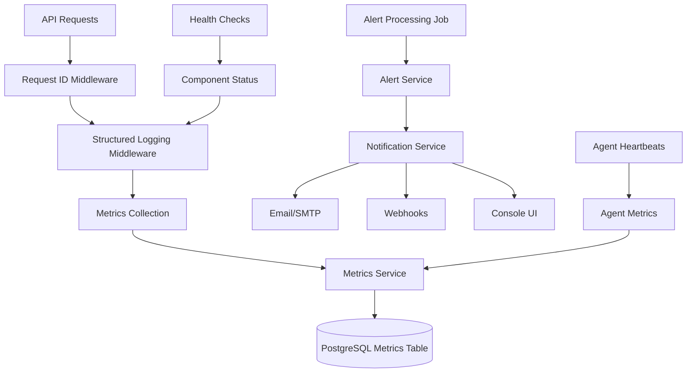

# NomOS Monitoring and Infrastructure Hardening - Technical Overview

## Executive Summary

This documentation covers the comprehensive monitoring, alerting, and infrastructure hardening improvements made to the NomOS system on April 13, 2026. These changes enhance system reliability, security, and operational visibility.

## Key Changes Implemented

### 1. Monitoring and Alerting System
- **Database Schema**: Added `alert_rules`, `alerts`, and `metrics` tables
- **API Endpoints**: New monitoring router with 7 endpoints
- **Services**: MetricsService and AlertService for data collection and processing
- **Middleware**: API metrics collection middleware
- **Background Jobs**: Alert processing job running every minute

### 2. Infrastructure Hardening
- **Vault Integration**: Mandatory Vault for secrets management
- **Setup Wizard**: First-time setup UI for Vault unseal, admin creation, 2FA, and LLM provider configuration
- **Request Correlation**: Unique request IDs for end-to-end traceability
- **Structured Logging**: JSON-formatted logs for SIEM compatibility
- **Health Checks**: Component-level status monitoring

### 3. Security Enhancements
- **Password Validation**: Minimum 12 characters with complexity requirements
- **Vault TTL Cache**: Reduced Vault load with graceful degradation
- **Docker Secrets**: Secrets from Vault via shared volumes
- **Gateway Integration**: Health monitoring and secret management

## Architecture Overview



## Component Details

### Monitoring Database Schema

**alert_rules Table:**
- Stores configurable alert thresholds
- Fields: metric_name, threshold_type, threshold_value, severity, notification_channels

**alerts Table:**
- Records triggered alerts and their lifecycle
- Fields: rule_id, severity, metric_name, current_value, triggered_at, resolved_at

**metrics Table:**
- Time-series data storage
- Fields: timestamp, metric_name, dimensions (JSONB), value, source

### API Endpoints

**GET /api/monitoring/metrics**
- Returns current system metrics with aggregation
- Supports time window filtering

**GET /api/monitoring/alerts**
- Lists active alerts
- Filterable by severity and status

**POST /api/monitoring/alert-rules**
- Creates new alert rules
- Validates threshold configurations

### Services

**MetricsService** (`nomos_api/services/metrics.py`)
- `record_metric()`: Stores time-series data
- `get_current_value()`: Calculates aggregated values
- `get_metrics_series()`: Retrieves historical data

**AlertService** (`nomos_api/services/metrics.py`)
- `check_alerts()`: Evaluates rules against current metrics
- `acknowledge_alert()`: Updates alert status
- `resolve_alert()`: Marks alerts as resolved
- Notification dispatching via multiple channels

### Middleware

**RequestIDMiddleware** (`nomos_api/middleware/request_id.py`)
- Assigns unique request IDs
- Propagates IDs through response headers
- Acts as safety net for unhandled exceptions

**JSONFormatter** (`nomos_api/middleware/logging.py`)
- Structured JSON logging
- Includes request context in logs
- SIEM-compatible format

## Metrics Collected

### API Performance
- Request volume by endpoint/method/status
- Latency percentiles (P99, P95, P50)
- Error rates (4xx/5xx)
- Throughput (requests per minute)

### Agent Health
- Heartbeat status (online/stale/offline)
- Task completion rates
- Response times
- Resource usage (CPU/memory)

### System Health
- Database connection pool usage
- Cache hit/miss ratios
- Vault sealed/unsealed status
- Gateway online/offline status

### Compliance
- Incident response times
- DSGVO deadline tracking
- Budget usage per agent
- Approval queue metrics

## Alerting System

### Threshold Types
- **Above**: Trigger when metric exceeds threshold
- **Below**: Trigger when metric falls below threshold
- **Change**: Trigger on significant metric changes

### Severity Levels
- **Critical**: Immediate action required (e.g., API down)
- **Warning**: Potential issues (e.g., high latency)
- **Info**: Informational alerts (e.g., maintenance)

### Notification Channels
- Email (SMTP integration)
- Webhooks (Slack/Teams/Microsoft Teams)
- Console UI (real-time dashboard)
- Audit Log (compliance recording)

## Infrastructure Hardening

### Vault Integration

**vault-init Service** (`vault/init-entrypoint.sh`)
- Idempotent Vault bootstrap
- Auto-init and auto-unseal
- Secret generation and storage
- AppRole credential creation

**Configuration Changes**
- `.env` reduced to only `NOMOS_DB_PASSWORD`
- All other secrets sourced from Vault
- Shared volume for secret distribution

### Setup Wizard

**4-Step Process:**
1. **Vault Unseal Key**: Display and confirmation
2. **Admin Account**: Email/password with recovery key
3. **2FA Setup**: TOTP configuration (optional)
4. **LLM Provider**: API key configuration (optional)

**Features:**
- Password strength meter
- Recovery key backup requirements
- QR code for 2FA setup
- Provider testing functionality

### Security Enhancements

**Password Validation**
- Minimum 12 characters
- Requires uppercase, lowercase, digit, and special character
- Real-time strength feedback

**Vault TTL Cache**
- 60-second cache for Vault secrets
- Reduces Vault load
- Graceful degradation on failure

**Request Correlation**
- Unique request IDs
- End-to-end traceability
- Error response consistency

## Deployment Instructions

### Database Migration

```bash
# Apply monitoring tables migration
cd nomos-api
alembic upgrade head
```

### Configuration

Add to `.env`:
```env
# Monitoring settings
MONITORING_METRICS_RETENTION_DAYS=30
MONITORING_ALERT_CHECK_INTERVAL=60

# Notification settings
SMTP_HOST=smtp.example.com
SMTP_PORT=587
SMTP_USER=alerts@nomos.local
SMTP_PASSWORD=your-password
SLACK_WEBHOOK_URL=https://hooks.slack.com/services/...
```

### Start Services

```bash
# Start API with monitoring enabled
docker compose up -d nomos-api

# Start worker with alert processing
docker compose up -d nomos-worker
```

## Example Usage

### Create Alert Rule

```bash
curl -X POST "http://localhost:8060/api/monitoring/alert-rules" \
  -H "Content-Type: application/json" \
  -H "X-NomOS-API-Key: your-api-key" \
  -d '{
    "metric_name": "api.latency",
    "threshold_type": "above",
    "threshold_value": 500,
    "severity": "warning",
    "comparison_window": "5m",
    "notification_channels": {
      "email": ["admin@nomos.local"],
      "webhook": ["https://slack.com/alerts"]
    },
    "description": "High API latency detected"
  }'
```

### Get Current Metrics

```bash
curl -X GET "http://localhost:8060/api/monitoring/metrics" \
  -H "X-NomOS-API-Key: your-api-key"
```

### List Active Alerts

```bash
curl -X GET "http://localhost:8060/api/monitoring/alerts?severity=critical" \
  -H "X-NomOS-API-Key: your-api-key"
```

## Best Practices

### Alert Management
- Start with few critical alerts
- Tune thresholds based on real-world behavior
- Avoid alert fatigue with appropriate severity levels
- Document runbooks for each alert type
- Review alert effectiveness monthly

### Metrics Collection
- Sample high-volume metrics
- Aggregate appropriately using time windows
- Implement retention policies
- Dimension wisely (only add queried dimensions)

### Dashboard Design
- Overview first (high-level health score)
- Drill-down for troubleshooting
- Show historical context and trends
- Make actionable with links to tools

## Troubleshooting

### Alerts Not Triggering
- Verify alert rule is active
- Check metric names match exactly
- Confirm thresholds are appropriate
- Review comparison windows

### Notifications Not Sent
- Verify notification channel configuration
- Check SMTP/webhook credentials
- Review notification service logs
- Test with manual alert creation

### High Metric Storage
- Reduce metrics retention period
- Increase aggregation windows
- Sample high-volume metrics
- Archive old metrics to cold storage

## Future Enhancements

### Short-Term (Next 3 Months)
- Prometheus exporter
- Grafana dashboards
- Alert escalation policies
- Maintenance windows

### Medium-Term (Next 6 Months)
- Anomaly detection (ML-based)
- Capacity planning reports
- SLA compliance reporting
- Multi-tenancy support

### Long-Term (Next Year)
- AIOps integration
- Root cause analysis
- Predictive alerting
- Benchmarking capabilities

## Conclusion

This comprehensive monitoring and alerting system provides real-time visibility into the NomOS platform, enabling proactive issue resolution and ensuring compliance with operational and regulatory requirements. The infrastructure hardening improvements enhance security posture and operational reliability.