# NomOS Monitoring and Infrastructure Hardening - Architecture Diagrams

## Table of Contents

1. [System Overview](#system-overview)
2. [Monitoring Architecture](#monitoring-architecture)
3. [Alerting Flow](#alerting-flow)
4. [Vault Integration](#vault-integration)
5. [Setup Wizard Flow](#setup-wizard-flow)
6. [Data Flow Diagrams](#data-flow-diagrams)
7. [Component Interactions](#component-interactions)
8. [Deployment Architecture](#deployment-architecture)

## System Overview

### High-Level Architecture

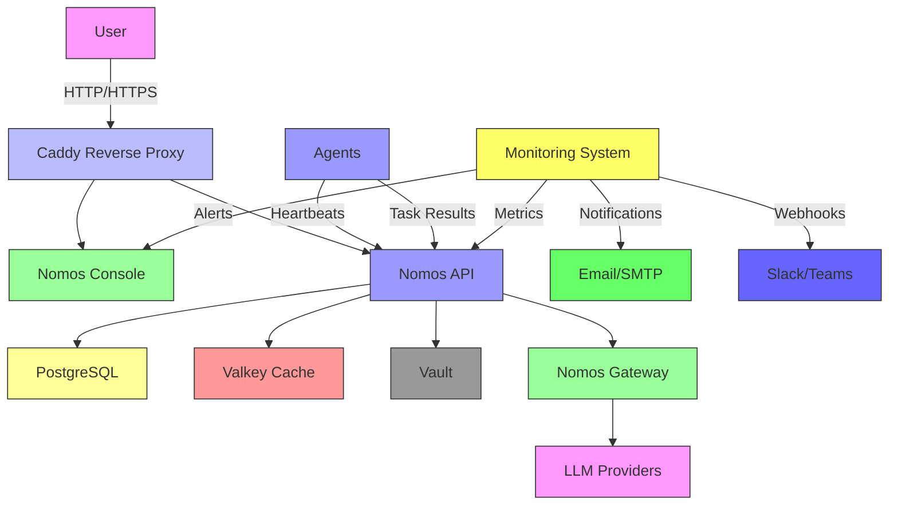

### Component Relationships

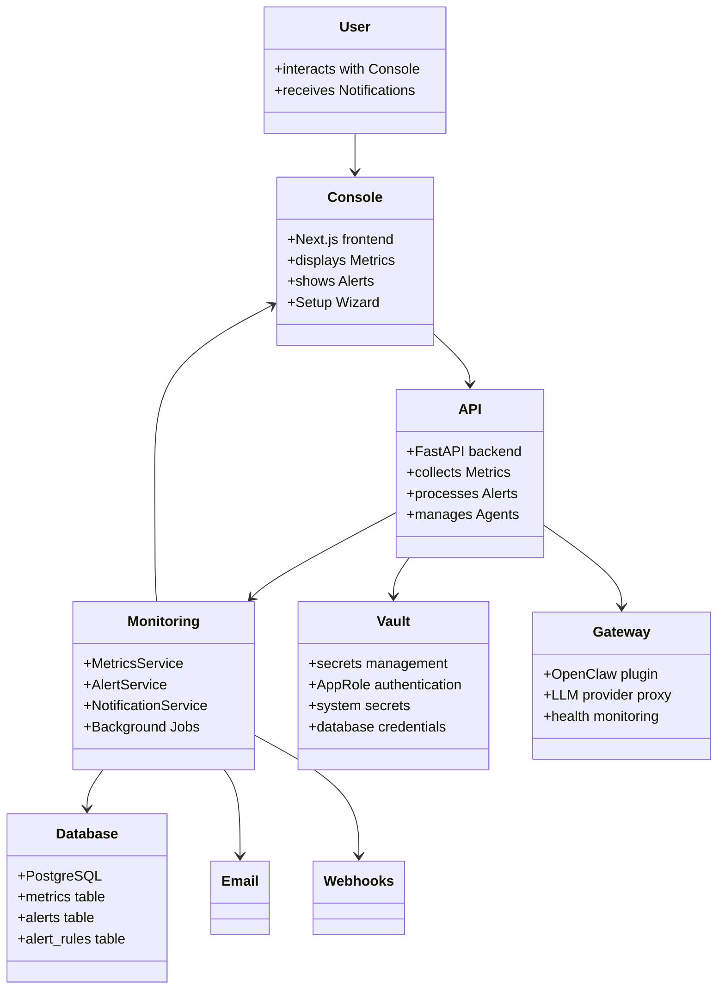

## Monitoring Architecture

### Metrics Collection Flow

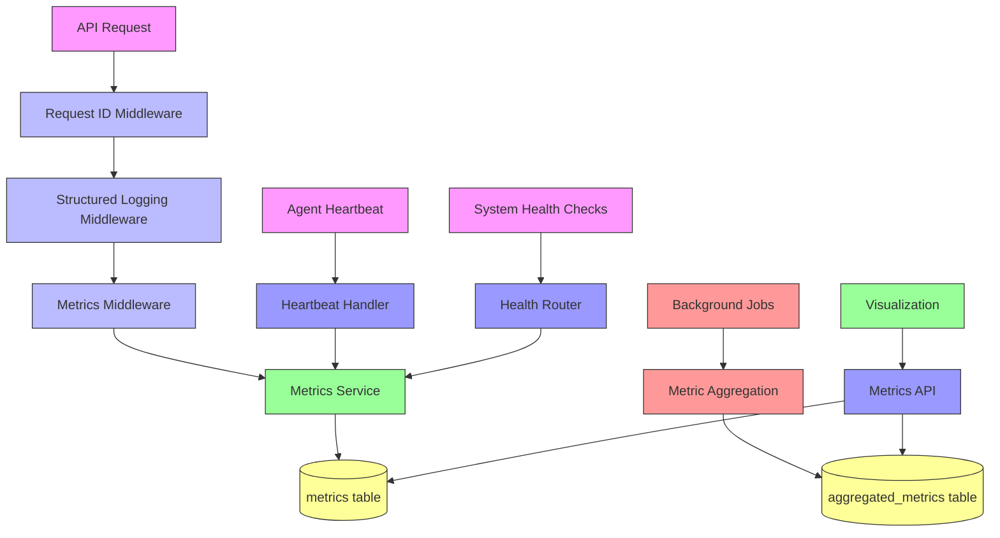

### Metrics Service Architecture

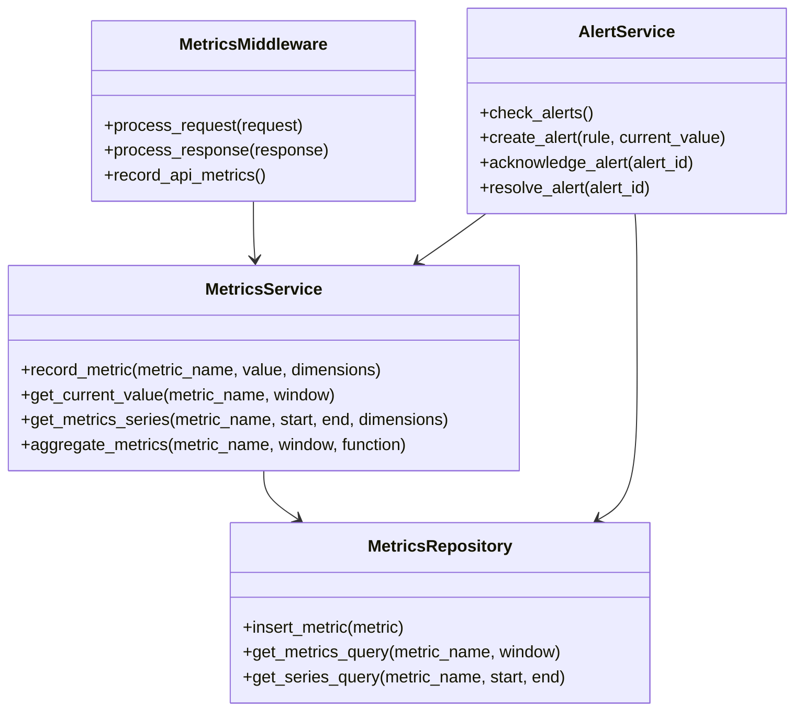

### Database Schema

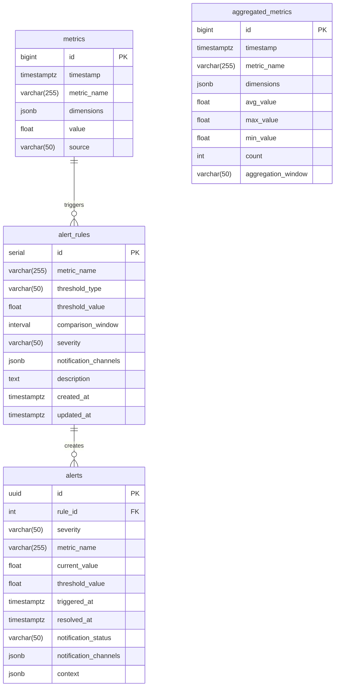

## Alerting Flow

### Alert Lifecycle

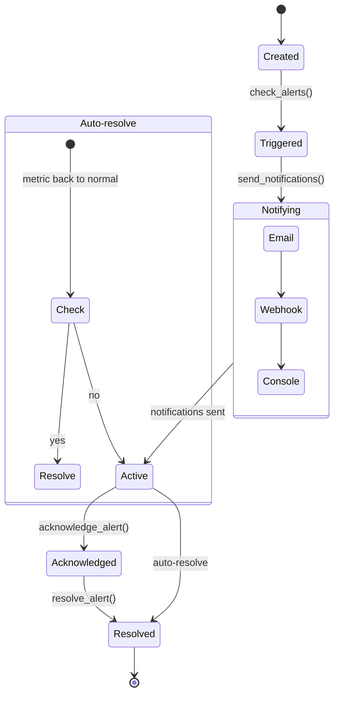

### Alert Processing Flow

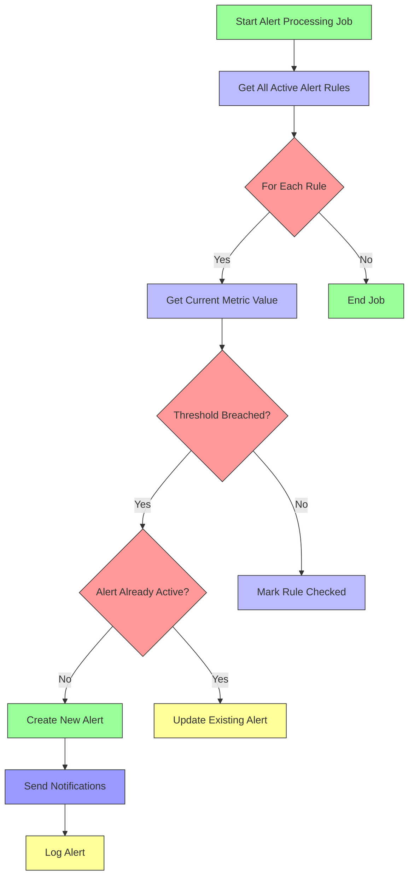

### Notification Service Architecture

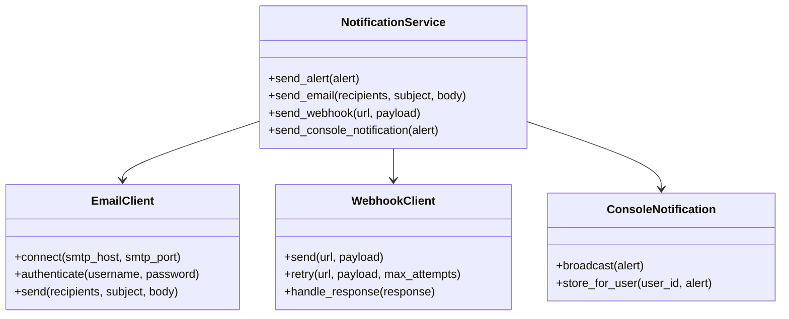

## Vault Integration

### Vault Architecture

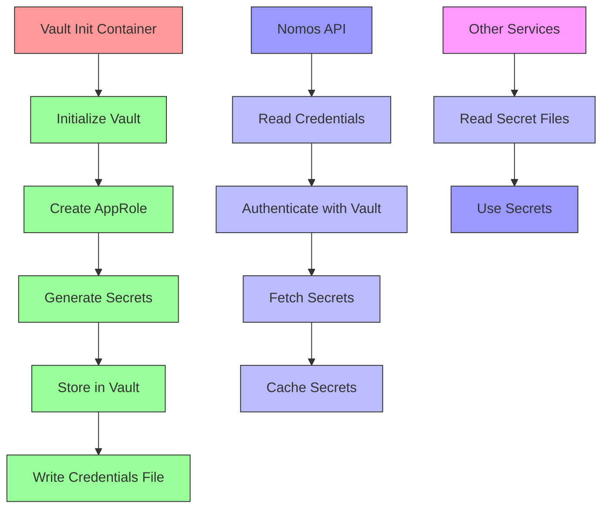

### Secrets Management Flow

```mermaid
sequenceDiagram
    participant Init as Vault Init Container
    participant Vault as Vault Server
    participant API as Nomos API
    participant DB as PostgreSQL
    
    Init->>Vault: operator init
    Vault-->>Init: unseal_keys, root_token
    Init->>Vault: secrets enable kv-v2 at nomos/
    Init->>Vault: policy write nomos-api
    Init->>Vault: auth enable approle
    Init->>Vault: write approle/role/nomos-api
    Init->>Vault: kv put nomos/secrets/system
    Init->>Vault: kv put nomos/secrets/database
    Init->>File: Write approle-creds.env
    
    API->>File: Read approle-creds.env
    API->>Vault: auth/approle/login
    Vault-->>API: client_token
    API->>Vault: kv/get nomos/secrets/system
    Vault-->>API: jwt_secret, plugin_api_key
    API->>Vault: kv/get nomos/secrets/database
    Vault-->>API: password
    API->>DB: Connect with credentials
    
    style Init fill:#f99,stroke:#333
    style Vault fill:#999,stroke:#333
    style API fill:#99f,stroke:#333
    style DB fill:#ff9,stroke:#333
```

### Vault Component Diagram

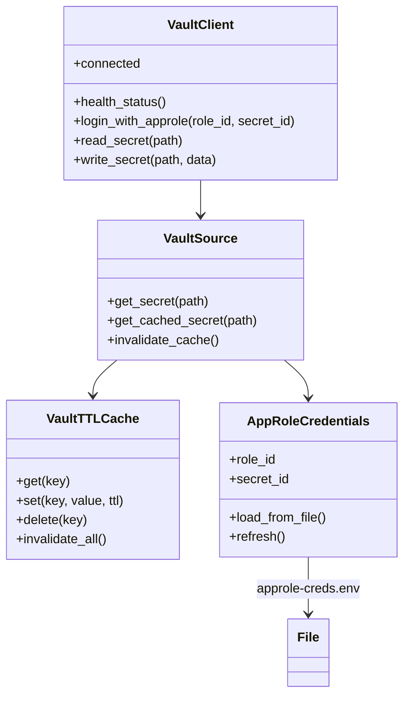

## Setup Wizard Flow

### Wizard State Machine

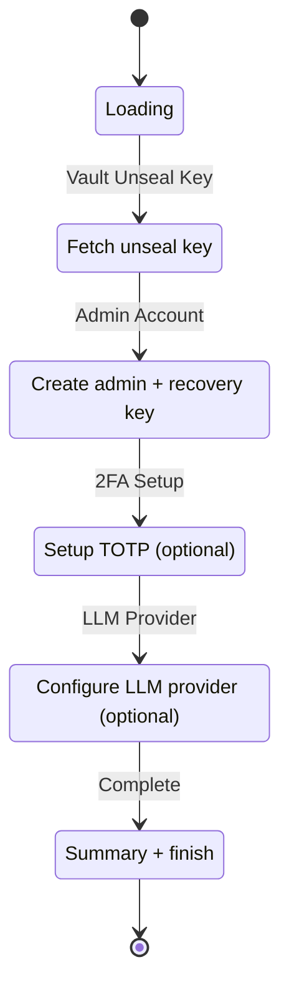

### Setup Wizard Sequence

```mermaid
sequenceDiagram
    participant User as User
    participant Console as Console
    participant API as API
    participant Vault as Vault
    participant DB as Database
    
    User->>Console: GET /setup
    Console->>API: GET /system/status
    API-->>Console: {setup_required: true}
    
    Console->>API: GET /system/unseal-key
    API->>Vault: Read init file
    Vault-->>API: unseal_key
    API-->>Console: {unseal_key: "...", auto_unseal: false}
    
    User->>Console: Submit unseal confirmation
    
    User->>Console: Enter admin credentials
    Console->>API: POST /users/bootstrap
    API->>DB: Create admin user
    API->>DB: Store recovery key
    API-->>Console: {user_id: "...", recovery_key: "..."}
    
    User->>Console: Confirm recovery key
    User->>Console: Setup 2FA (optional)
    Console->>API: POST /auth/2fa/setup
    API-->>Console: {qr_code: "...", secret: "..."}
    User->>Console: Enter TOTP code
    Console->>API: POST /auth/2fa/verify
    
    User->>Console: Select LLM provider
    User->>Console: Enter API key
    Console->>API: PATCH /settings
    Console->>API: GET /proxy/status
    API-->>Console: {status: "ok"}
    
    Console->>User: Show completion screen
    User->>Console: Click "Start Using NomOS"
    Console->>User: Redirect to /admin
    
    style User fill:#f9f,stroke:#333
    style Console fill:#9f9,stroke:#333
    style API fill:#99f,stroke:#333
    style Vault fill:#999,stroke:#333
    style DB fill:#ff9,stroke:#333
```

### Setup Wizard Components

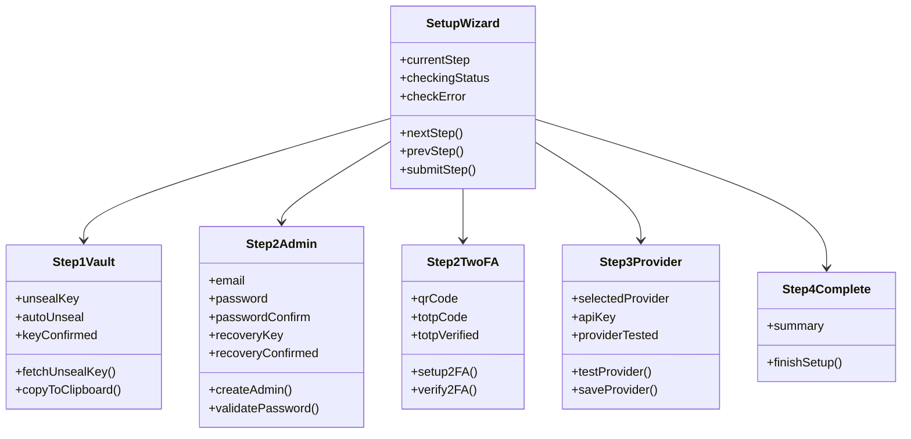

## Data Flow Diagrams

### Metrics Data Flow

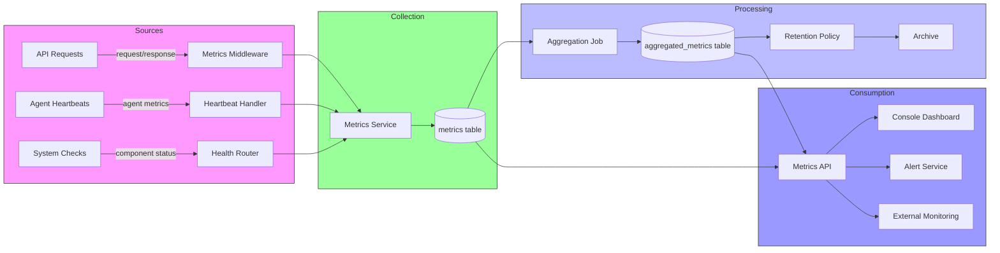

### Alert Data Flow

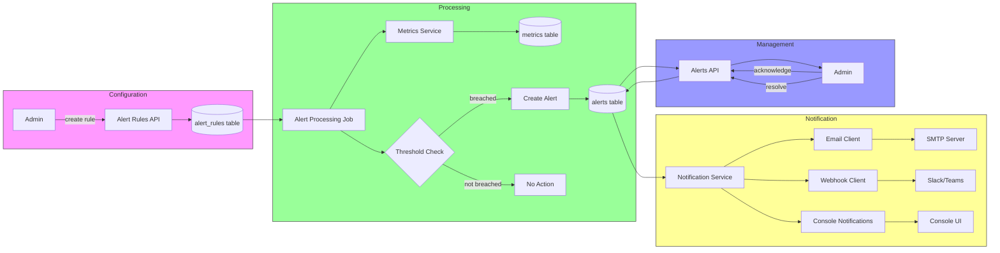

### Request Flow with Monitoring

```mermaid
sequenceDiagram
    participant User as User
    participant Caddy as Caddy
    participant Console as Console
    participant API as API
    participant Middleware as Middleware
    participant Service as Service
    participant DB as Database
    
    User->>Caddy: GET /api/agents
    Caddy->>API: Forward request
    API->>Middleware: Request ID Middleware
    Middleware->>Middleware: Generate request_id
    Middleware->>Middleware: Add to request.state
    Middleware->>Service: Call next middleware
    
    Service->>Middleware: Structured Logging Middleware
    Middleware->>Middleware: Add logging context
    Middleware->>Service: Call next middleware
    
    Service->>Middleware: Metrics Middleware
    Middleware->>Middleware: Start timer
    Middleware->>Service: Call next middleware
    
    Service->>Service: Handle request
    Service->>DB: Query agents
    DB-->>Service: Return results
    
    Service->>Middleware: Return response
    Middleware->>Middleware: Stop timer
    Middleware->>MetricsService: Record API metrics
    MetricsService->>DB: Insert metric
    
    Middleware->>Logging: Log request
    Logging->>File: Write structured log
    
    Middleware->>User: Return response with X-Request-ID
    
    style User fill:#f9f,stroke:#333
    style Caddy fill:#bbf,stroke:#333
    style Console fill:#9f9,stroke:#333
    style API fill:#99f,stroke:#333
    style Middleware fill:#bbf,stroke:#333
    style Service fill:#99f,stroke:#333
    style DB fill:#ff9,stroke:#333
```

## Component Interactions

### Middleware Stack

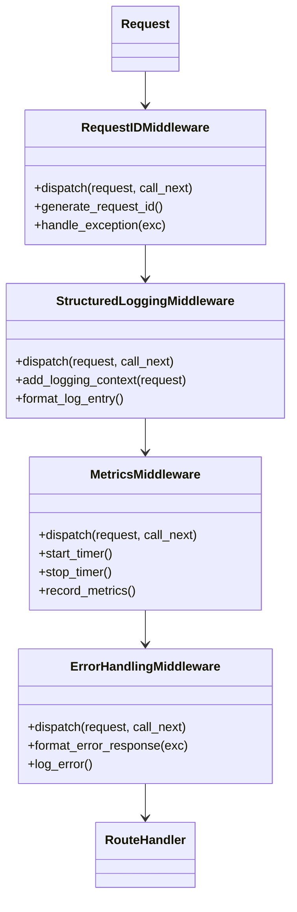

### API Router Structure

```mermaid
classDiagram
    class APIRouter
    
    class HealthRouter {
        +GET /health
        +GET /api/health
        +check_vault_status()
        +check_postgres()
        +check_valkey()
        +check_gateway()
    }
    
    class MonitoringRouter {
        +GET /metrics
        +GET /alerts
        +POST /alerts
        +PATCH /alerts/{id}
        +GET /alert-rules
        +POST /alert-rules
        +DELETE /alert-rules/{id}
    }
    
    class SystemRouter {
        +GET /system/status
        +GET /system/unseal-key
        +POST /system/setup
    }
    
    class UsersRouter {
        +POST /users/bootstrap
        +POST /users
        +GET /users/{id}
        +PATCH /users/{id}
    }
    
    APIRouter <|-- HealthRouter
    APIRouter <|-- MonitoringRouter
    APIRouter <|-- SystemRouter
    APIRouter <|-- UsersRouter
```

### Service Dependencies

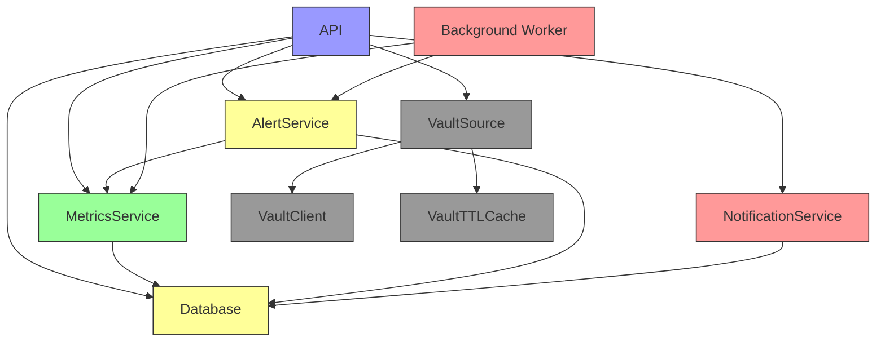

## Deployment Architecture

### Docker Compose Architecture

```mermaid
flowchart TD
    subgraph Services
        A[nomos-caddy] -->|reverse proxy| B[nomos-console]
        A -->|reverse proxy| C[nomos-api]
        C --> D[nomos-postgres]
        C --> E[nomos-valkey]
        C --> F[nomos-vault]
        C --> G[nomos-worker]
        G --> D
        G --> E
        G --> F
        H[nomos-gateway] --> I[LLM Providers]
        C --> H
    end
    
    subgraph Volumes
        J[/vault/file] --> F
        J --> K[vault-init]
        K --> C
        K --> G
        K --> H
        L[postgres-data] --> D
        M[valkey-data] --> E
    end
    
    subgraph Networks
        N[nomos_default] --> A
        N --> B
        N --> C
        N --> D
        N --> E
        N --> F
        N --> G
        N --> H
    end
    
    style Services fill:#f9f,stroke:#333
    style Volumes fill:#ff9,stroke:#333
    style Networks fill:#9f9,stroke:#333
```

### Production Deployment

```mermaid
graph LR
    subgraph Load Balancer
        A[Internet] --> B[Cloud Load Balancer]
    end
    
    subgraph Kubernetes Cluster
        B --> C[Ingress Controller]
        C --> D[nomos-console Pods]
        C --> E[nomos-api Pods]
        
        subgraph Database
            E --> F[PostgreSQL StatefulSet]
            E --> G[Valkey Cluster]
        end
        
        subgraph Vault
            E --> H[Vault StatefulSet]
            E --> I[vault-init Job]
        end
        
        subgraph Workers
            J[nomos-worker Deployment] --> F
            J --> G
            J --> H
        end
        
        subgraph Gateway
            K[nomos-gateway Deployment] --> L[LLM Providers]
            E --> K
        end
    end
    
    subgraph Monitoring
        M[Prometheus] --> E
        M --> F
        M --> G
        M --> H
        N[Grafana] --> M
        O[Alertmanager] --> M
        O --> P[Email]
        O --> Q[Slack]
    end
    
    style Load Balancer fill:#bbf,stroke:#333
    style Kubernetes fill:#9f9,stroke:#333
    style Database fill:#ff9,stroke:#333
    style Vault fill:#999,stroke:#333
    style Workers fill:#f99,stroke:#333
    style Gateway fill:#99f,stroke:#333
    style Monitoring fill:#ff6,stroke:#333
```

### High Availability Architecture

```mermaid
graph TD
    A[User] --> B[Global Load Balancer]
    B --> C[Region 1]
    B --> D[Region 2]
    B --> E[Region 3]
    
    subgraph Region 1
        C --> F1[nomos-api x3]
        C --> G1[nomos-console x2]
        F1 --> H1[PostgreSQL HA]
        F1 --> I1[Valkey Cluster]
        F1 --> J1[Vault HA]
        F1 --> K1[nomos-worker x2]
        F1 --> L1[nomos-gateway x2]
    end
    
    subgraph Region 2
        D --> F2[nomos-api x3]
        D --> G2[nomos-console x2]
        F2 --> H2[PostgreSQL HA]
        F2 --> I2[Valkey Cluster]
        F2 --> J2[Vault HA]
        F2 --> K2[nomos-worker x2]
        F2 --> L2[nomos-gateway x2]
    end
    
    subgraph Region 3
        E --> F3[nomos-api x3]
        E --> G3[nomos-console x2]
        F3 --> H3[PostgreSQL HA]
        F3 --> I3[Valkey Cluster]
        F3 --> J3[Vault HA]
        F3 --> K3[nomos-worker x2]
        F3 --> L3[nomos-gateway x2]
    end
    
    subgraph Cross-Region
        H1 --> M[PostgreSQL Logical Replication]
        H2 --> M
        H3 --> M
        
        J1 --> N[Vault Replication]
        J2 --> N
        J3 --> N
    end
    
    subgraph Monitoring
        O[Prometheus Federation] --> F1
        O --> F2
        O --> F3
        P[Grafana] --> O
        Q[Alertmanager] --> O
    end
    
    style Region 1 fill:#9f9,stroke:#333
    style Region 2 fill:#9f9,stroke:#333
    style Region 3 fill:#9f9,stroke:#333
    style Cross-Region fill:#bbf,stroke:#333
    style Monitoring fill:#ff6,stroke:#333
```

## Conclusion

These architecture diagrams provide comprehensive visualizations of the NomOS monitoring and infrastructure hardening improvements. They illustrate component relationships, data flows, and deployment architectures to help understand the system design and implementation.