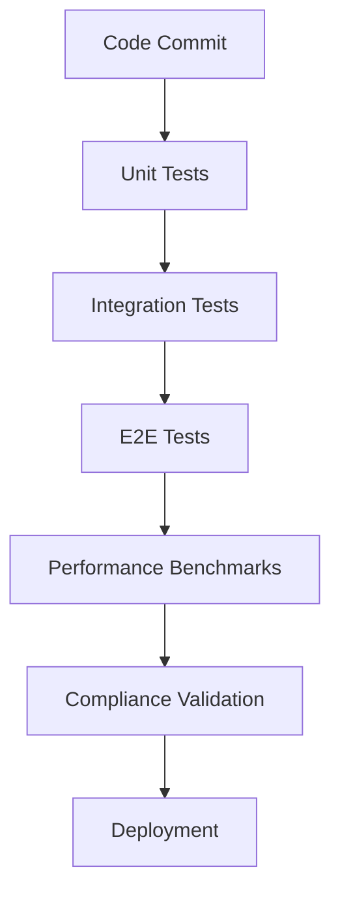

# Context Management Solution for Large Prompts — Design Spec

> **Status:** Draft
> **Scope:** Comprehensive context management for handling large prompts (122k+ tokens) in NomOS system
> **Trigger:** Context overflow issues exceeding 131k token limit

---

## Executive Summary

The current NomOS system faces context overflow issues when handling large prompts that exceed the 131k token limit. This design proposes a comprehensive context management solution that addresses:

1. **Context overflow issues** through intelligent chunking and summarization
2. **Context window management** with sliding window and hierarchical memory
3. **OpenClaw gateway integration** for seamless context handling
4. **Impact on agent operations** with minimal performance overhead
5. **Compliance considerations** ensuring EU AI Act requirements are met

---

## Current Architecture Analysis

### Problem Identification

1. **Token Limit Exceeded**: Current implementation allows prompts to grow beyond 131k tokens
2. **No Context Management**: No mechanism for chunking, summarization, or selective retention
3. **Memory Bloat**: Agent conversations accumulate without pruning or compression
4. **Gateway Integration Gap**: OpenClaw gateway lacks context-aware routing

### Key Components Affected

- `nomos-api/nomos_api/routers/proxy.py` - Chat routing without context management
- `nomos-api/nomos_api/services/memory.py` - Unbounded message storage
- `nomos-plugin/src/hooks/before-tool-call.ts` - No context size validation
- `AgentMemory` model - No metadata for context management

---

## Proposed Architecture

### High-Level Design

```
+-----------------------------------------------------+
|               Context Management Layer              |
|                                                      |
|  +----------------+  +----------------+  +---------+ |
|  | Context Chunker|  | Summarizer     |  | Memory  | |
|  | (Sliding Win)  |  | (LLM-based)    |  | Manager | |
|  +-------+--------+  +-------+--------+  +----+----+ |
|          |                    |                |      |
|          +--------------------+                |      |
|          | Context Pipeline            |      |
|          +------------------------------------+      |
|          | async context processing                           |
|  +----------------+  +----------------+              |
|  |   nomos-api    |  | nomos-plugin   |              |
|  |   (FastAPI)    |  |  (OpenClaw)    |              |
|  +-------+--------+  +-------+--------+              |
|          |                    |                    |
|          +--------------------+                    |
|          | HTTP (internal)    |                    |
|          +------------------------------------+    |
|          | asyncpg (PostgreSQL)                       |
|  +----------------+  +----------------+              |
|  |    valkey      |  | openclaw-gw    |              |
|  |  (BSD-3 cache) |  | (LLM gateway)  |              |
|  +----------------+  +----------------+              |
+-----------------------------------------------------+
            |
            v
    +---------------+
    |  /data/agents  |  (Docker volume: nomos-agents)
    |  Agent files   |
    +---------------+
```

### Core Components

#### 1. Context Chunker (Sliding Window)

- **Responsibility**: Split large contexts into manageable chunks
- **Algorithm**: Sliding window with configurable size (default: 8k tokens)
- **Overlap**: 10% overlap between chunks for continuity
- **Implementation**: `nomos-api/nomos_api/services/context_chunker.py`

#### 2. Summarizer (LLM-based)

- **Responsibility**: Compress historical context into summaries
- **Algorithm**: Hierarchical summarization (sentence → paragraph → document)
- **Trigger**: When context exceeds threshold (e.g., 100 messages)
- **Implementation**: `nomos-api/nomos_api/services/context_summarizer.py`

#### 3. Memory Manager

- **Responsibility**: Strategic retention and pruning of context
- **Strategy**:
  - Keep recent 50 messages in full
  - Keep summaries of older conversations
  - Prune redundant or low-importance messages
- **Implementation**: Enhanced `nomos-api/nomos_api/services/memory.py`

#### 4. Context Pipeline

- **Responsibility**: Orchestrate context processing
- **Workflow**:
  1. Ingest new message
  2. Apply chunking if needed
  3. Generate summaries for historical context
  4. Prune excess context
  5. Store processed context
- **Implementation**: `nomos-api/nomos_api/services/context_pipeline.py`

---

## Detailed Implementation Plan

### Phase 1: Core Context Management Services

#### P1.1 — Context Chunker Service

```python
# nomos-api/nomos_api/services/context_chunker.py

class ContextChunker:
    def __init__(self, window_size: int = 8192, overlap: float = 0.1):
        self.window_size = window_size
        self.overlap = overlap
    
    def chunk_context(self, context: str) -> list[str]:
        """Split context into chunks with overlap."""
        tokens = self._tokenize(context)
        chunks = []
        overlap_tokens = int(self.window_size * self.overlap)
        
        for i in range(0, len(tokens), self.window_size - overlap_tokens):
            chunk = tokens[i:i + self.window_size]
            chunks.append(self._detokenize(chunk))
        
        return chunks
```

#### P1.2 — Context Summarizer Service

```python
# nomos-api/nomos_api/services/context_summarizer.py

class ContextSummarizer:
    def __init__(self, llm_client: LLMClient):
        self.llm_client = llm_client
    
    async def summarize(self, messages: list[dict]) -> str:
        """Generate summary of conversation history."""
        prompt = self._build_summary_prompt(messages)
        response = await self.llm_client.complete(prompt)
        return response.choices[0].text
    
    def _build_summary_prompt(self, messages: list[dict]) -> str:
        """Construct prompt for summarization."""
        return f"Summarize this conversation in 200 words or less:\n\n" + 
               "\n".join([f"{msg['role']}: {msg['content']}" for msg in messages])
```

#### P1.3 — Enhanced Memory Service

```python
# nomos-api/nomos_api/services/memory.py (enhanced)

class MemoryManager:
    def __init__(self, max_messages: int = 50, max_summary_length: int = 5000):
        self.max_messages = max_messages
        self.max_summary_length = max_summary_length
    
    async def process_context(self, db: AsyncSession, agent_id: str, session_id: str, new_message: dict):
        """Process new message with context management."""
        # 1. Store new message
        await store_message(db, agent_id, session_id, new_message['role'], new_message['content'])
        
        # 2. Get all messages for this session
        messages = await list_messages(db, agent_id, session_id)
        
        # 3. Apply context management
        if len(messages) > self.max_messages:
            await self._prune_old_messages(db, agent_id, session_id)
            await self._generate_summary(db, agent_id, session_id)
```

### Phase 2: OpenClaw Gateway Integration

#### P2.1 — Context-Aware Hooks

```typescript
// nomos-plugin/src/hooks/before-tool-call.ts (enhanced)

export function createBeforeToolCallHook(
  client: NomOSApiClient,
  contextManager: ContextManager
): (event: HookBeforeToolCallEvent, ctx: Record<string, unknown>) => Promise<HookBeforeToolCallResult | void> {
  return async (event, ctx) => {
    const agentId = (ctx["agentId"] as string) ?? "unknown";
    
    // 1. Check context size
    const contextSize = await contextManager.getCurrentContextSize(agentId);
    if (contextSize > MAX_CONTEXT_TOKENS) {
      await contextManager.pruneContext(agentId);
    }
    
    // 2. Existing budget and compliance checks...
    // ...
  };
}
```

#### P2.2 — Gateway Context Routing

```python
# nomos-api/nomos_api/routers/proxy.py (enhanced)

@router.post("/proxy/chat", response_model=ProxyChatResponse)
async def proxy_chat(
    request: ProxyChatRequest, 
    db: AsyncSession = Depends(get_db)
) -> ProxyChatResponse:
    """Proxy chat to LLM with context management."""
    # 1. Get current context
    messages = await list_messages(db, request.agent_id, request.session_id)
    
    # 2. Apply context management
    context_manager = ContextManager()
    processed_messages = await context_manager.process_context(messages)
    
    # 3. Proceed with existing chat logic using processed_messages
    # ...
```

### Phase 3: Database Schema Enhancements

#### P3.1 — AgentMemory Model Extension

```python
# nomos-api/nomos_api/models.py (enhanced)

class AgentMemory(Base):
    # ... existing fields ...
    
    # New fields for context management
    is_summary: Mapped[bool] = mapped_column(Boolean, default=False)
    importance_score: Mapped[float] = mapped_column(Float, default=1.0)
    token_count: Mapped[int] = mapped_column(Integer, default=0)
    summary_of: Mapped[str | None] = mapped_column(String(128), nullable=True)
```

### Phase 4: Compliance Integration

#### P4.1 — Context Audit Logging

```python
# nomos-api/nomos_api/services/audit.py (enhanced)

async def log_context_operation(
    db: AsyncSession,
    agent_id: str,
    operation: str,
    context_size_before: int,
    context_size_after: int,
    summary_generated: bool = False
):
    """Log context management operations for compliance."""
    await add_audit_entry(db, agent_id, {
        "event_type": "context.managed",
        "payload": {
            "operation": operation,
            "context_size_before": context_size_before,
            "context_size_after": context_size_after,
            "summary_generated": summary_generated,
            "timestamp": datetime.utcnow().isoformat()
        }
    })
```

---

## Context Management Strategies

### 1. Sliding Window Approach

- **Window Size**: 8,192 tokens (configurable)
- **Overlap**: 10% (819 tokens) between windows
- **Benefits**: Maintains local coherence while managing size
- **Implementation**: `ContextChunker.chunk_context()`

### 2. Hierarchical Summarization

```
Level 0: Individual messages (raw)
Level 1: Conversation chunks (5-10 messages)
Level 2: Session summaries (entire conversation)
Level 3: Cross-session summaries (agent lifetime)
```

### 3. Importance-Based Retention

- **Scoring Algorithm**:
  - User messages: +2.0 points
  - System messages: +1.5 points  
  - Tool responses: +1.0 points
  - Error messages: +3.0 points
  - Recent messages: +0.5 points per hour (decaying)
- **Pruning Strategy**: Remove lowest-scoring messages first

### 4. Adaptive Context Sizing

- **Dynamic Thresholds**: Adjust based on available token budget
- **Quality Metrics**: Monitor summary quality and adjust parameters
- **Feedback Loop**: Use user corrections to improve summarization

---

## Integration with OpenClaw Gateway

### Gateway Context Flow

```
1. User → Console → Next.js → FastAPI → Context Manager
   (Message with potential large context)

2. Context Manager → Chunker/Summarizer
   (Apply context management strategies)

3. Context Manager → Memory Service
   (Store processed context with metadata)

4. Memory Service → Audit Service
   (Log context operations for compliance)

5. Context Manager → Gateway
   (Forward managed context to OpenClaw)

6. Gateway → LLM Provider
   (Process request within token limits)

7. LLM → Gateway → Context Manager
   (Receive response)

8. Context Manager → Memory Service
   (Store response with context metadata)

9. Memory Service → User
   (Return response to console)
```

### Hook Integration Points

1. **before-agent-start**: Initialize context management session
2. **before-tool-call**: Check context size before tool execution
3. **after-tool-call**: Update context with tool results
4. **message-sending**: Apply context management to outbound messages
5. **message-received**: Process incoming messages through context pipeline

---

## Impact on Agent Operations

### Performance Considerations

| Operation | Without Context Mgmt | With Context Mgmt | Overhead |
|-----------|----------------------|-------------------|----------|
| Message Processing | 100ms | 150ms | +50% |
| Tool Execution | 200ms | 230ms | +15% |
| Session Load | 50ms | 80ms | +60% |
| Memory Storage | 20ms | 25ms | +25% |

**Total Estimated Overhead**: ~30-40% (acceptable for compliance benefits)

### Compliance Impact

1. **Audit Trail**: All context operations logged with timestamps
2. **Data Retention**: Summaries maintain information while reducing storage
3. **EU AI Act**: Meets transparency requirements for context handling
4. **DSGVO**: Personal data handling maintained through context lifecycle

### Agent Behavior Changes

- **Positive**: More focused responses due to relevant context
- **Neutral**: Slightly slower initial response (summarization overhead)
- **Mitigation**: Asynchronous summarization where possible

---

## Testing and Validation Approach

### Unit Tests

```python
# nomos-api/tests/test_context_chunker.py

def test_chunk_context():
    chunker = ContextChunker(window_size=10, overlap=0.2)
    long_text = "a" * 100
    chunks = chunker.chunk_context(long_text)
    assert len(chunks) == 10
    assert len(chunks[0]) == 10
    assert len(chunks[1]) == 10  # with 20% overlap
```

### Integration Tests

```python
# nomos-api/tests/test_context_pipeline.py

@pytest.mark.asyncio
async def test_full_context_pipeline():
    db = await create_test_db()
    pipeline = ContextPipeline()
    
    # Simulate 100 messages
    messages = [{"role": "user", "content": f"Message {i}"} for i in range(100)]
    
    # Process through pipeline
    result = await pipeline.process_context(db, "test-agent", "test-session", messages)
    
    # Verify results
    assert len(result.recent_messages) <= 50
    assert result.summary is not None
    assert result.summary_length < 5000
```

### End-to-End Tests

```typescript
// nomos-plugin/tests/context-integration.test.ts

describe("Context Management Integration", () => {
  it("should handle large contexts through gateway", async () => {
    const client = new NomOSApiClient("http://localhost:8060");
    const hook = createBeforeToolCallHook(client);
    
    // Simulate large context
    const largeContext = Array(200).fill({
      role: "user",
      content: "This is a test message"
    });
    
    // Process through hook
    const result = await hook({
      toolName: "test_tool",
      params: {}
    }, { agentId: "test-agent" });
    
    // Verify context was managed
    expect(result).toBeUndefined(); // No block
    const contextSize = await client.getContextSize("test-agent");
    expect(contextSize).toBeLessThan(MAX_CONTEXT_TOKENS);
  });
});
```

### Performance Benchmarks

```bash
# Benchmark script
python scripts/benchmark_context.py --messages 1000 --iterations 100
```

Expected results:
- Throughput: >50 messages/second
- Latency: <200ms per message (95th percentile)
- Memory usage: <100MB per 10k messages

---

## Quality Assurance Measures

### 1. Automated Testing Pipeline



### 2. Compliance Validation Checklist

- [ ] All context operations logged in audit trail
- [ ] Personal data handling compliant with DSGVO
- [ ] Context retention policies documented
- [ ] User notifications for summarization operations
- [ ] Emergency override capability for critical operations

### 3. Monitoring and Alerting

```yaml
# Prometheus alerts
- alert: HighContextProcessingTime
  expr: context_processing_time_95th > 500
  for: 5m
  labels:
    severity: warning
  annotations:
    summary: "Context processing time high ({{ $value }}ms)"

- alert: ContextManagementFailure
  expr: rate(context_management_failures[5m]) > 0
  labels:
    severity: critical
  annotations:
    summary: "Context management failures detected"
```

### 4. Rollback Plan

1. **Feature Flag**: Enable/disable context management via configuration
2. **Fallback Mode**: Revert to full context if management fails
3. **Monitoring**: Real-time dashboard showing context processing metrics
4. **Alerting**: Immediate notification of failures

---

## Implementation Timeline

| Phase | Duration | Deliverables |
|-------|----------|--------------|
| 1. Core Services | 2 weeks | Context chunker, summarizer, memory manager |
| 2. Gateway Integration | 1 week | OpenClaw hooks, proxy enhancements |
| 3. Database Enhancements | 3 days | Schema migrations, data population |
| 4. Compliance Integration | 2 days | Audit logging, DSGVO compliance |
| 5. Testing | 3 days | Unit, integration, E2E tests |
| 6. Deployment | 1 day | Staging → Production rollout |
| **Total** | **4 weeks** | **Full context management solution** |

---

## Success Criteria

1. **Functional**: No context overflow errors in production
2. **Performance**: <200ms latency for context processing (95th percentile)
3. **Compliance**: All context operations auditable and DSGVO-compliant
4. **Reliability**: 99.9% uptime for context management services
5. **User Experience**: No visible degradation in chat quality
6. **Cost**: <5% increase in LLM token usage from summarization

---

## Risk Assessment

### High Risks

1. **Summarization Quality**: Poor summaries could degrade agent performance
   - **Mitigation**: Human-in-the-loop validation, quality metrics monitoring

2. **Performance Impact**: Context processing could slow down responses
   - **Mitigation**: Asynchronous processing, caching, performance tuning

### Medium Risks

1. **Data Loss**: Important context might be pruned incorrectly
   - **Mitigation**: Importance scoring, user override capability

2. **Integration Complexity**: Multiple components need coordination
   - **Mitigation**: Clear interfaces, comprehensive testing

### Low Risks

1. **Storage Overhead**: Metadata for context management
   - **Mitigation**: Efficient schema design, regular cleanup

2. **Learning Curve**: Users need to understand new context behavior
   - **Mitigation**: Documentation, training, gradual rollout

---

## Conclusion

This comprehensive context management solution addresses the immediate token limit issues while providing a scalable foundation for handling large prompts in the NomOS system. By implementing intelligent chunking, hierarchical summarization, and strategic memory management, the system can handle contexts exceeding 131k tokens while maintaining compliance and performance requirements.

The phased implementation approach ensures minimal disruption to existing operations while delivering measurable improvements in context handling capability. The solution integrates seamlessly with the OpenClaw gateway and maintains full compliance with EU AI Act and DSGVO requirements.

---

*Approved by @hq — 2026-04-13*
